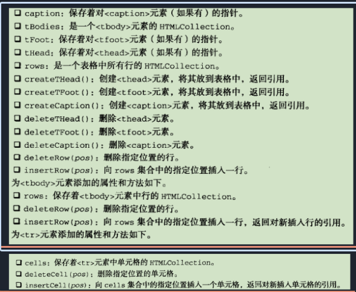

#DOM（第十章）

## Node 类型

-   除了 IE 之外的浏览器都可以访问这个节点类型
-   Node 类型中定义的属性常量用来分辨节点类型（但是 IE 不支持 Node 类型，就没有这些常量可以拿来对比）
-   所有节点都继承于 Node 类型
-   节点关系
    -   nodeType
    -   nodeName
    -   nodeValue
    -   parentNode
    -   childNodes
        -   保存了 NodeList 对象--一种类数组对象，可以通过方括号访问元素，是动态的，但是不同于 Array 对象
        -   可以通过数组的 Array.prototype.slice.call(nodes,0)对 IE 之外的浏览器的 childNodes 进行转换，对于 IE 只能用 Array.push,两种方式的选择使用 try-catch 实现
        -   length
        -   item()
    -   previousSibling
    -   nextSibling
    -   firstChild
    -   lastChild
    -   hasChild
    -   ownerDocument
        -   指向整个文档的文档节点
-   操作节点
    -   appendChild
        -   如果传入的节点已经是文档的一部分了，那么就从原来的位置转移到新的位置
    -   insertBefore
    -   replaceChild
        -   被替换的节点还在文档中，但是没有它的位置了（疑问：垃圾回收在哪里？）
    -   removeChild
    -   cloneNode
        -   参数：true --深复制，复制节点以及整个子节点树
        -   参数：fasle --浅复制，仅仅复制当前节点（孤儿）
        -   不会复制节点的属性，但是 IE 就会复制事件处理程序（bug）
    -   normalize
        -   用于处理文本节点：删除空文本节点，合并相邻的文本节点

## Document

-   通过 Document 类型创建文档，浏览器中 document 时 HTMLDocument(继承自 Document）的实例
-   nodeType = 9
-   nodeName = #document

##### HTMLDocument

###### document

-   HTMLDocument 的实例
-   字节点
    -   documentElement
        -   指向`<html>`
    -   body
    -   doctype
        -   指向<!DOCTYPE>
        -   兼容性：IE8 之前都当作注释，IE9+，Firefox 当作节点，opera，safari，chrome 会解析但是不会当作节点
-   文档信息
    -   title
    -   URL
    -   domain
        -   可以设置的，但是只能从 tight 设置到 loose，只能从子域名设置到上级域名
    -   referer
-   查找元素
    -   getElementById()
        -   多个 ID 相同，只会返回第一个出现的节点
    -   getElementsByTagName( )
        -   返回 NodeList，在 HTML 文档中返回 HTMLCollection，和 NodeList 属性大致相同，但是多了 namedItem():通过 name 属性寻找节点，当传入`*`，表示所有的节点
        -   没有区分大小写（虽然标准上让区分）
    -   getElementsByName( )
        -   常用于单选按钮的发送
-   特殊集合
    -   anchors
        -   带有 name 的`<a>`元素
    -   form
    -   images
    -   links
        -   带有 href 的`<a>`元素
-   一致性检测
    -   implementation
        -   hasFeature( )
            -   参数：要检测的 DOM 功能名称，版本号
-   文档写入
    -   write()
    -   writeIn()
    -   open()
    -   close()

## Element

-   nodeType = 1
-   nodeName = 标签名

##### HTMLElement

-   tagName
    -   HTML 中标签名全部使用大写
-   HTML 元素
    -   id
    -   title
    -   lang
    -   dir
    -   className
-   获得属性
    -   getAttribute( )
    -   setAttribute( )
    -   removeAttribute( )
    -   style
        -   getAttribute 获得是 css 文本，通过'.style'获得是对象
    -   onclick（等事件处理程序）
        -   通过 getAttribute 获得的是字符串，通过'.onclick'获得是函数
-   设置属性
    -   setAttribute
        -   自定义属性必须使用 setAttribute
-   attribute
    -   NamedNodeMap
        -   attribute 的集合，类似于 NodeList
    -   getNamedItem( )
    -   removeNamedItem( )
    -   setNamedItem( )
    -   specified( )
        -   true:属性被修改过，不是默认值
-   创建元素
    -   createElement( )
        -   参数：标签名

## Text

-   nodeType = 3
-   nodeName = #text
-   nodeValue = 包含的文本
-   其中的字符串添加之后会被转义
-   data
    -   文本信息
-   appendData
-   deleteData(offset, count)
-   insertData(offset, text)
-   replaceData(offset, count, text)
-   splitText(offset, count)
    -   返回前面的内容，保留之后内容
-   subStringData(offset, data)
-   creatDataNode()

## Comment

    - createComment()

## CDATASection

    - XML中使用，这里忽略

## DocumentType

    - nodeType = 10
    - nodeName = doctype
    - 大部分关于兼容性的在上文介绍过

## DocumentFragment

    - nodeType = 11
    - nodeName = #document-doctype
    - 轻量级文档，当作仓库存放节点以便一次性添加节点，防止反复渲染造成的问题(例如表格）
    - appendChild()
    - insertBefore

## Attr

    - nodeType = 2
    - nodeName = 属性名称
    - nodeValue = 属性的值
    - name
    - value
    - specified
    - createAttribute
        - 参数： 属性名称
        - 返回的是节点
    - setAttribute
        - 把属性添加到节点
        - 参数：属性节点

## 动态脚本

```javascript
var script = document.creatElement("script")
try{
    script.appendChild(document.creatTextNode("function(){} ) );
}catch(ex){
    script.text = "function(){}"
}
document.body.appendChild(script)
```

## 动态样式

```javascript
var style = document.creatElement('script');
style.type = 'text/css';
try {
    style.appendChild(document.creatTextNode('......'));
} catch (ex) {
    style.styleSheet.cssText = '......';
}
var header = document.getElementsByTagName('head')[0];
header.appendChild(style);
```

## 表格操作


