# 面向对象的程序设计

-   开头：
    -   ECMA-262 把对象定义为：“无序属性的集合，其属性可以包含基本值、对象或者函数
    -   可以把对象想象成散列表，键值对

## 6.1 理解对象

#### 6.1.1 属性类型

-   前言

    -   定义只有内部才使用的特性，描述了属性的各种特征
    -   为了 JavaScript 引擎使用的，不能直接访问的

-   数据属性
    -   描述数据属性行为的特性：
        -   `[[Configurable]]`能否通过 delete 删除属性和重新定义属性，一旦配置 false 就不能撤回了,默认 true
        -   `[[Enumerable]]`能否通过 for-in 循环返回属性,默认 true
        -   `[[Writable]]`能否修改属性的值,默认 true
        -   `[[Value]]`包含属性的值，读取属性的值，从这和位置读，从这个位置写入,默认 true
    -   修改属性默认的特性：`Object.defineProperty()
        -   三个参数： 属性所在对象， 属性名字， 一个描述符对象
            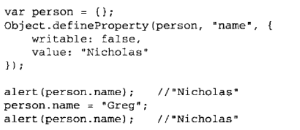
        -   调用这个方法时候如果不指定其他特性，就会默认 false
-   访问器属性
    -   访问器属性不包含数据值，只包含 getter,setter 函数
        -   一般属性前面加上`_`表示只能通过对象方法访问的属性
    -   访问器属性的四个特性
        -   `[[Configurable]]`
        -   `[[Enumerable]]`
        -   `[[Get]]`读取访问器属性使用 getter 函数
        -   `[[Set]]`写入访问器属性使用 setter 传入新值,可以通过函数同属修改多个属性值，接收参数，`newValue`，表示属性新传入的值
    -   访问器属性不能直接定义，必须通过 Object.defineProperty()

#### 6.1.2 定义多个属性

-   Object.defineProperties()
    -   参数：1：添加或者修改的对象，2：对象的属性，以及其中的特性
        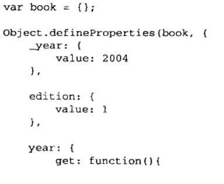

#### 6.1.3 读取属性的特性

-   Object.getOwnPropertyDescriptor(),取得给定属性的描述
    -   参数：属性所在对象，要读取其描述符的属性名称
    -   返回值：对象

## 6.2 创建对象

#### 6.2.1 工厂模式

-   抽象了创建对象的具体过程，用函数封装以特定的接口创建对象的细节
    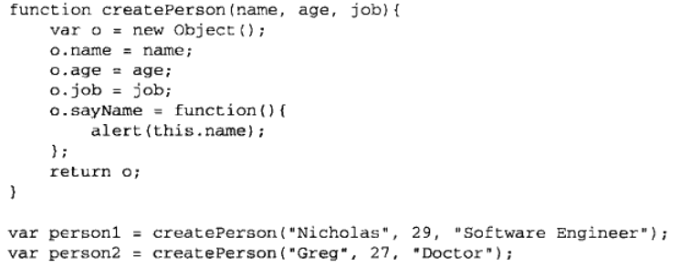

#### 6.2.2 构建函数模式

-   前言：
    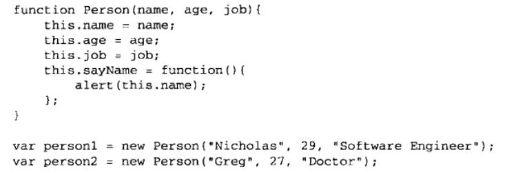
    -   与工厂模式不同：
        -   没有显示创建兑现
        -   直接把属性和方法赋值给了 this 对象
        -   没有 return 语句
    -   为了区分，构造函数始终都因该以大写字母开头，必须是使用 new 操作符
    -   构建函数创建实例的实际过程
        -   创建新对象
        -   将构造函数的作用域赋给新对象
        -   执行构建函数的代码
        -   返回新对象
    -   实例的`constructor`(构造函数)都指向构建函数，同样`instanceof`也能检测
-   将构建函数当作函数
    -   构建函数与普通函数其实没有区别只差用`new`操作符调用
-   构建函数的问题
    -   主要问题：每个方法都要在实例上重新创建一遍（显得冗余）
    -   解决方法：
        -   把函数放在构建函数之外，进行调用
            -   带来新问题：全局作用域的函数只能被某个对象调用，让这个全局作用域有点名不副实，对于自定义额引用类型没有任何封装性可言

#### 6.2.3 原型模式

-   前言：每个函数都有一个 prototype 属性，指向原型<strong>对象</strong>
    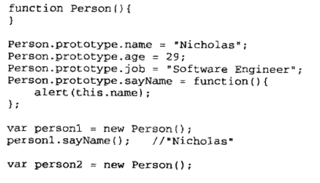
-   理解原型对象
    -   所有原型对象都有`constructor`属性，指向`prototype`属性所在函数的指针
    -   通过`isPrototypeOf()`确定对象之间是否存在这种关系
    -   `Object.getPrototypeOf()`返回 Prototype 的值
    -   重写属性（方法）会屏蔽掉原型对象的属性（方法）
    -   `delete`操作符可以删除实例属性，重新让原型对象的属性发挥作用
    -   `hasOwnProperty()`检测属性式存在于实例中还是原型中
-   原型与 in 操作符
    -   in 操作符：用于判断属性是否在对象中
    -   同时使用`hasOwnProperty`和`in`操作符可以确定属性在对象中还是原型中
    -   使用`for-in`循环的式所有能够通过对象访问的，可以枚举的属性
    -   `Object.keys()`取得所有可以枚举的实例属性，以对象作为参数
    -   `Object.getOwnPropertyNames()`可以获得所有实例属性，无论是否可以枚举（包括 constructor）
-   更简单的原型对象
    -   通过对象字面量重写原型对象，但是重写的结局就是`constructor`不在指向构造函数了，原因就是构造函数在创建的时候就自动连接了`constructor`，但是可以通过直接对`constructor`赋值重新连接
-   原型的动态性
    -   原型与实例之间的连接时松散的，任何修改都可以立即在所有实例中反映出来
-   原生对象的原型
    -   可以直接对原生对象（如：String)定义新方法，但不推荐，里有如定义全局变量
-   原型对象的问题
    -   省略了初始化参数的环节，结果是所有实例在默认下都取得相同的属性值

#### _6.2.4 组合使用构造函数模式和原型模式_

-   组合使用构造函数和原型模式 - 构造函数模式定义实例属性 - 原型模式定义方法和共享的属性
    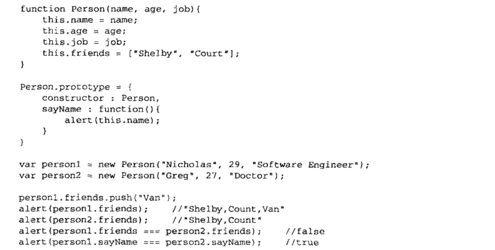
-   最为广泛，认认同度最高的创建自定义类型的方法

#### 6.2.5 动态原型模式

-   致力于把所有的信息都封装到构造函数中，通过构造函数初始化原型，同时保证构造函数和原型的优点
    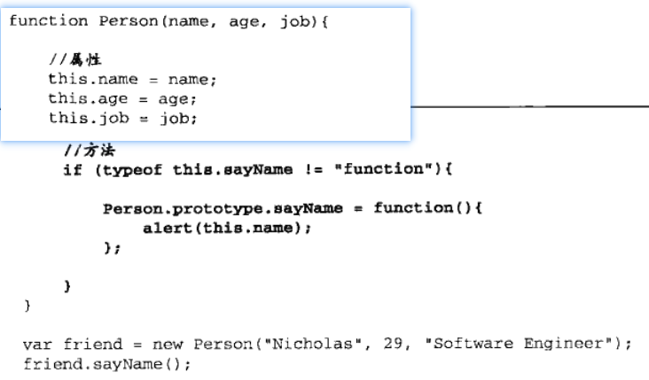
-   if 检测的是否属性和方法，只检查一个就行了
-   不能用字面量重写，会切断现有实例与新原型的联系

#### 6.2.6 寄生构造函数模式

-   基本思想：创建函数，函数的作用仅仅是封装创建对象的代码，并且返回新创建的对象
    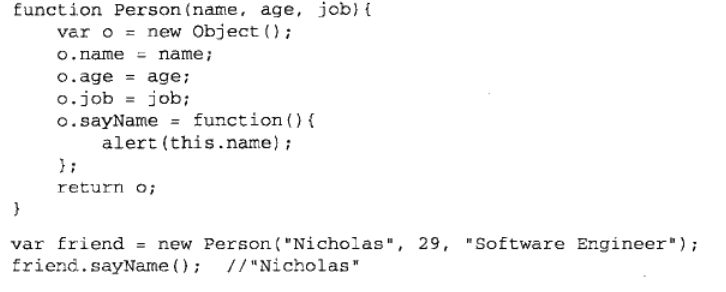
-   和工厂模式差不多，多了一个 new
-   返回的对象与构造函数构建函数的原型没有关系，不建议使用

#### 6.2.7 稳妥构造函数模式

-   稳妥，指的是没有公共属性，而且其方法不引用 this 的对象
-   与寄生不同之处 - 不用 this - 不用 new

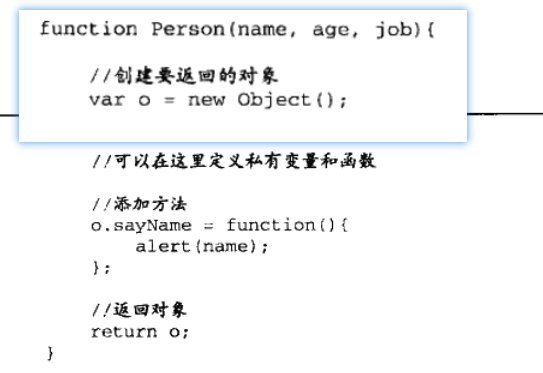

-   即使有其他方法会给对象添加方法和数据成员，单数不可能有别的办法访问构造函数中的原始数据

## 6.3 继承

-   许多 OO 语言都支持两种继承方式：接口继承与实现继承；接口继承只继承方法签名，实现继承继承实际的方法。
-   ECMAscript 只支持实现继承，实现的方式主要是依靠原型链

#### 6.3.1 原型链

-   前言：
    -   基本思想：利用原型让一个引用类型继承拎一个引用类型的属性和方法。
        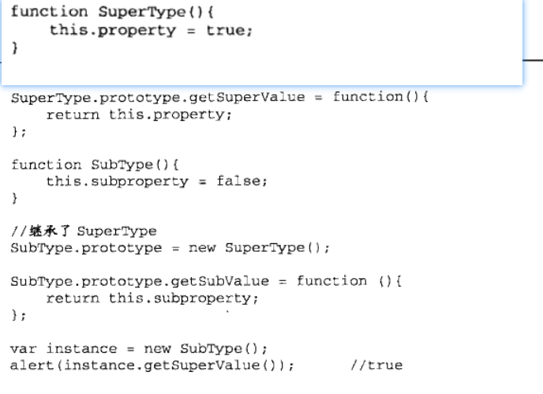
-   别忘记模型的原型
    -   所有函数的默认原型都是 Object 的实例，因此默认原型都包含内部指针指向 Object.prototype
-   确定原型和实例的关系
    -   第一种使用 instanceof
    -   第二种使用 isPrototypepOf()
-   谨慎定义方法
    -   子类型添加新方法或者重写方法一定要在替换原型之后进行
    -   不能用对象字面量创建原型方法，这会导致继承失败
-   原型链的问题
    -   最主要的问题来自于包含引用类型值的原型，继承了原型的实例属性
    -   第二个问题：创建子类型实例时，不能向超类型的构造函数中传递参数；实际是没有办法在不影响所有对象实例的情况下，给超类型的构造函数传递参数

#### 6.3.2 借用构建函数

-   前言： - 思想：在子类型内部调用超类型构造函数 - 函数只不是特定环境中执行代码的对象，通过 apply()和 call()可以在新创建的对象上执行构造函数
    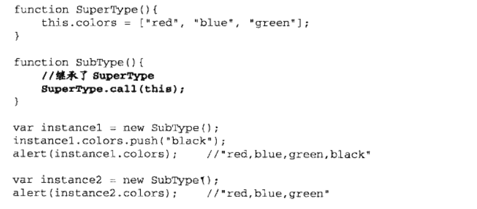
-   在子类型每个实例上都有超类型实例的副本了
-   传递参数
    -   可以在子类型构造函数向超类型的构造函数的传递参数，归功于 apply()/call()的第二个参数
-   借用构建函数的问题
    -   方法在构造函数中定义，函数复用无从谈起
    -   超类型定义的方法对于子类型是不可见

#### _6.3.3 组合继承_

-   原型链和借用构造函数的技术组合一起，发挥两者之长
    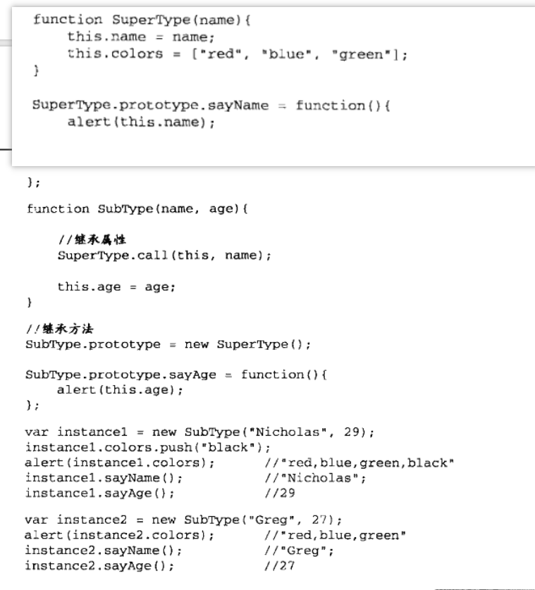
-   是最常用的继承模式

#### 6.3.4 原型链继承

-   借助原型可以基于已有的对象创建新对象，同时不必创建自定义类型
    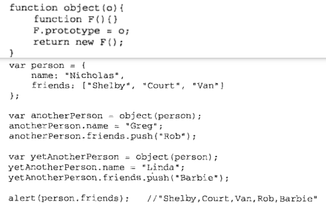
-   这种原型链需要一个对象作为另一个对象基础
-   ECMAScript5 增加了`Object.create()`规范了原型式继承， - 第一个参数：一个对象作为原型对象创建构造函数 - 第二个参数：每个属性的描述化语句 - 直接返回实例
    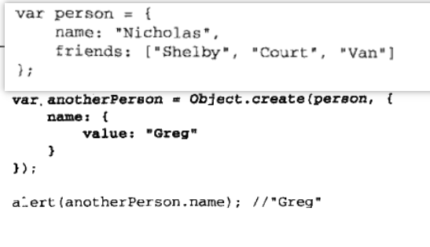

#### 6.3.5 寄生式继承

-   创建一个仅用于封装继承过程的函数，该函数内部以某种方式增强对象，最后像真的它做了所有工作一样返回对象
    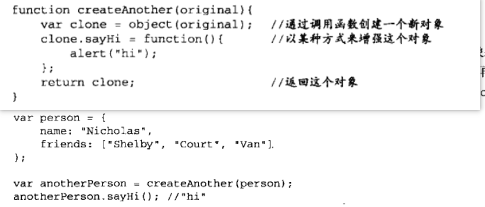
-   和原型式有什么区别？

#### 6.3.6 寄生组合式继承

-   组合继承最大问题就是，无论什么时候都会调用两次超类型构造函数
    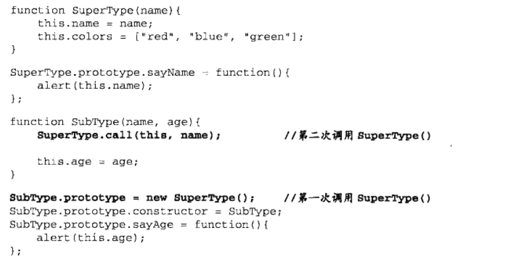
-   如上两次继承了超类型，一次在类型，一次在实例，实例中属性屏蔽了类型中的继承
-   含义：借用构造函数继承属性，原型链混成心事继承方法
    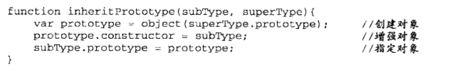
-   内部创建超类型副本
-   添加 constructor 属性，弥补重写原型导致的断裂
-   把创建的对象副本赋值子类型类型
-   普遍理想继承范式
