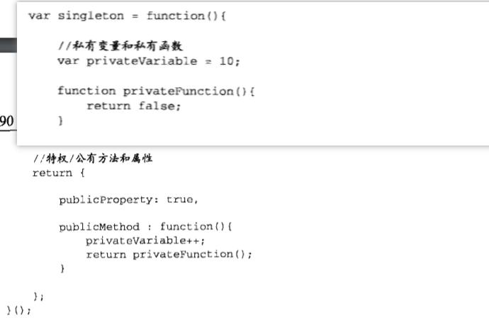

# 函数表达式
- 函数声明具有提升的性质
- 函数表达式用匿名函数赋值，因为function关键字后面没有标识符（匿名函数也叫拉姆达函数），匿名函数与命名函数相对而言
## 7.1 递归
- 函数之间赋值是浅拷贝，是指针之间的传递，其中任意一个环节出现问题都有可能导致后面的指针访问不到函数
- 除了函数名可以完成递归，还有arguments.callee也指向所在函数
## 7.2 闭包
- 含义：闭包指的是：有权访问另一个函数作用域中变量的函数
- 创建闭包的常用方式：在一个函数内部创建另一个函数
- 创建的过程：
    - 后台的每个执行环境都有一个表示变量的对象一变量对象。 全局环境的变量对象始终存在，而像compare ()函数这样的局部环境的变量对象，则只在函数执行的过程中存在。在创建compare() 函数时，会创建一个预先包含全局变量对象的作用域链，这个作用域链被保存在内部的[ [Scope]]属性中。当调用compare ()函数时，会为函数创建一个执行环境，然后通过复制函数的[ [Scope] ]属性中的对象构建起执行环境的作用域链。此后，又有一个活动对象(在此作为变量对象使用)被创建并被推入执行环境作用城链的前端。对于这个例子中compare ()函数的执行环境而言，其作用域链中包含两个变量对象:本地活动对象和全局变量对象。显然，作用域链本质上是一个指向变量对象的指针列表，它只**引用**但不实际包含变量对象。
    无论什么时候在函数中访问一个变量时，就会从作用域链中搜索具有相应名字的变量。一般来讲，当函数执行完毕后，局部活动对象就会被销毁，内存中仅保存全局作用域(全局执行环境的变量对象)。但是，闭包的情况又有所不同。
    - 函数执行完以后活动对象仍然不会被摧毁，因为匿名函数的作用域链人在在引用这个活动对象，只有匿名函数执行完毕，外部对象才会被销毁
    - 闭包会携带大量作用域，因此会占用很多内存，所以最好不用

#### 7.2.1 闭包与变量
- 闭包只能取得包含函数中任何变量最后一个值，稳定的值，这就说明了闭包不能和包含函数实时互动。但是可以通过匿名函数强制执行：
    
    - 这里只有返回函数才能形成匿名函数，否则只能是对象的一个方法
    - 这里没有把闭包赋值给数组，而是定义一个匿名函数，立即执行匿名函数的结果，由于函数传参是按值传递的，所以把i的当前值复制给参数num
#### 7.2.2 关于 this 对象
- 匿名函数的执行环境具有全局性，它的this指向window，如果想让匿名函数访问内部的this，只有把this复制给另一个变量，这让匿名函数在搜寻的时候就会率先搜寻内部对象
#### 7.2.3 内存泄漏
- 匿名函数包含的活动对象中应用HTML元素，必然会导致element一致无法销毁，正确的做法是：用完把element节带置空（null）

## 7.3 模仿块级作用域
- JavaScript不管多次声明变量，会忽略后面的声明
- 匿名函数模仿块级作用域语法
    ```javascript
    (function(){
        //这里是块级作用域
    })();
    ````
- function关键字表明函数声明的开始，加上括号可以自动转化为函数表达式
- 没有匿名函数的引用，在函数执行完毕以后就自动销毁，减少内存
## 7.4 私有变量
- 任何在函数中定义的变量都可以被认为是私有变量
#### 7.4.1 静态私有变量

- 通过内部定义构造函数，但是没有声明，就能提升到全局变量，通过这个可以访问内部私有变量
- 这里构造的函数属性仍然是所有实例所共享的
#### 7.4.2 模块模式
- 特权方法：有权访问私有变量的公共方法
- 模块模式针对单例创建的，只有一个实例对象，模块模式能给单例添加私有变量和特权方法

- 返回的对象字面量是单例的公共接口
#### 7.4.3 增强的模块模式
- 适合那些单例确定是某种类型的实例，同时还必须添加某些属性和方法对其加强的情况

## 小结
