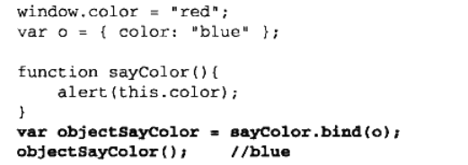
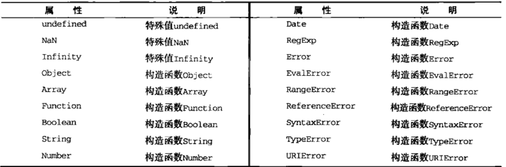
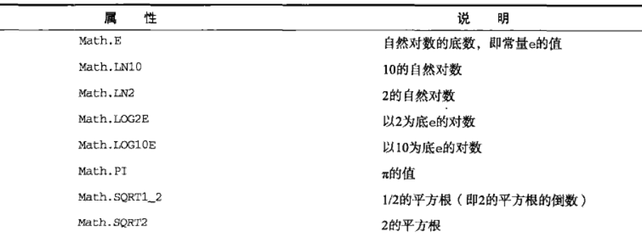
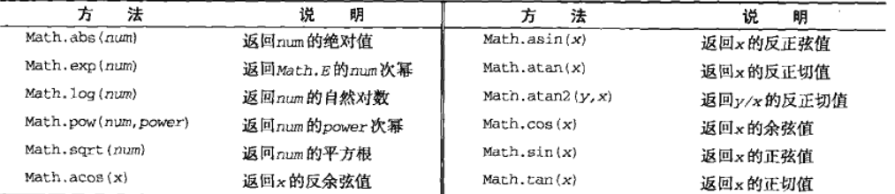

# 引用类型

### Object 类型

-   不具备多少功能，但是对于存储和传输数据而言，是理想的选择
-   创建方式
    -   new 构造函数
    -   对象字面量(推荐)
        -   注意这种类似于添加对象的方法中，最后加“；”
        -   对象的值会被自动转换为`字符串`
-   访问对象的值，其中的方括号的优点就是可以通过变量名访问

### Array 类型

-   创建方式
    -   构造函数
    -   构造函数 + length 参数
    -   构造函数 + 数组中包含的值
-   如果索引值超过了 length 会自动扩充
-   length 可以修改
-   检测数组
    -   `instanceof`操作符
    -   isArray()
-   转换方法
    -   toString() 默认以“，”拼接
    -   valueOf()返回数组
    -   toLocalString()不太理解，就是对每一项都调用 toString?
    -   join()
-   栈方法
    -   push()
    -   pop()
    -   shift()
    -   unshift()
-   重排序方法
    -   reverse()
    -   sort()默认字符串排序，可以传入比较参数
-   操作方法
    -   concat()
        -   基于当前数组创建一个新数组
        -   参数可以为多个数组
    -   slice()
        -   裁剪从开始到终点（不包括终点）所有项
        -   接收一个或者两个参数
    -   splice()
        -   第一个参数，其实裁剪的位置
        -   第二个参数，裁剪数目
        -   第三个参数以及以后的参数都是需要添加的项
        -   返回被裁剪的数组
-   位置方法
    -   indexOf()
    -   lastIndexOf()
-   迭代方法
    -   都接收两个参数
        -   参数一，在每一个项运行的函数
        - 这个函数的参数：element, index, array
        -   参数二，运行该函数的作用域对象
    -   every()
    -   filter()
        -   由返回为 true 的项组成函数
    -   forEach()
        -   对每一项运行函数，没有返回值
    -   map()
        -   运行函数，返回每次函数调用的结果组成的数组
    -   some()
-   归并方法
    -   两个参数
        -   每个项上调用函数
            -   这个函数可以接收四个参数
                -   前一个值，当前值，项的索引，数组对象
        -   作为归并基础的初始值
    -   reduce()
    -   reduceRight()
    -   补充：是从 index = 1 位置遍历，并且初始化 index = 0 的数据项

### Date 类型

-   构造函数参数是毫秒数
-   基础的数值是 1970.1.1 到现在的毫秒数来保存的
-   Date.parse()接收表示日期的字符串参数，返回日期的毫秒数
-   如果直接把这个日期字符串直接传给构造函数，会在后台调用 Date.parse()
-   Date.UTC()同样返回日期的毫秒数，不过基于军用日期毫秒数
-   Date.now()返回当前日期的毫秒数
-   继承的方法（区别不常用，调试可能用到）
    -   toLocaleString()返回和浏览器使用的日期
    -   toString()返回带有时区的日期
    -   valueOf()返回毫秒表示
-   日期的格式化方法
    -   toDateString()
    -   toTimeSting()
    -   toLocalDataString()
    -   toLocalTimeSting()
    -   toUTCString()
-   日期/时间组件方法
    -   获取日期中特定部分的值

### RegExp 类型

-   `let expression = / pattern / flags`
-   pattern 是正则表达式
-   flags 表明正则表达式的行为
    -   g i m
-   元字符： `([{\^$|00}])?*+.`
-   通过构造函数（接收字符串参数）构造正则表达式，所有的元字符必须进行双重转义
-   实例属性
    -   globa
    -   ignoreCase
    -   lastIndex 搜索下一个匹配项的字符位置
    -   multiline
    -   source 正则表达式的字符串表示
-   实例方法
    -   exec()
        -   捕获组
        -   参数：模式字符串(应用的字符串)，返回匹配信息的数组
        -   返回数组两个额外的属性
            -   index:匹配项在字符串中位置
            -   input：应用的字符串
    -   text()
        -   返回是否匹配到
        -   参数：应用的字符串
    -   valueOf()返回正则表达式本身
-   构造函数属性（有缩写，不列出）
    -   input 最近一次匹配的字符串
    -   lastMatch 最近一次匹配性
    -   lastParen 最后匹配的捕获组
    -   leftContext input 字符串中 lastMatch 之前的文本
    -   multiline 是否所有的表达式都是使用的多行模式
    -   rightContext input 字符串中 lastMatch 之后的文本

### Function 类型

-   解析器会率先读取函数声明，而不是函数表达式（毕竟是赋值，等到加载到了才会赋值）
-   函数内部属性：
    -   arguments
        -   callee 指向 arguments 对应的函数
        -   caller 指向当前函数的地址是那一个地址（函数）保存的
    -   this
-   函数的属性和方法
    -   length 表示函数希望接收额参数数量
    -   prototype
        -   保存它所有实例方法和真正所在
    -   每个函数都包含非继承而来的方法
        -   都是用于在特定的作用域调用函数，例如在一个函数中调用另一个函数，可以通过传入`变量对象`方式实现传递变量对象
        -   apply()
            -   参数 1：运行函数的作用域
            -   参数 2：参数数组
        -   call()
            -   参数与 apply()大致相同，只不过参数数组需要一一列举
        -   强大之处在于可以修改/扩充函数的作用域
        ```javascript
        let o = {
            color: 'red'
        };
        function sayColor() {
            alert(this.color);
        }
        sayColor(o); //red
        ```
    -   bind()
        -   创建函数实例时，会绑定作用域到新的函数中
            
    -   toLocaleString() toString()返回的都是函数代码的字符串表示，valueOf 也是

### 基本包装类型

-   三个特殊引用类型:String, Number, Boolean
-   每当**读取**一个基本数据类型，后台就会创建一个对应的基本包装类型的对象（然后迅速销毁？）
-   读取基本数据类型流程：
    -   创建基本包装类型对象
    -   在实例上执行希望的方法
    -   销毁创建的实例
-   Boolean 类型
    -   重写了 valueOf(),toString()返回布尔值
-   Number 类型
    -   重写了 valueO(), toLocaleString()返回基本数据类型的字符串形式
    -   valueOf()返回基本数据类型数值
    -   toFixed()指定小数点位数
    -   toExponential()返回指数表示，参数同样指定小数位数
    -   toPrecision()选择合适的转换方法
-   String 类型
    -   charAt()输出指定位置的字符
    -   charCodeAt()输出指定位置的字符编码
    -   字符串同样有 concat()/但是级联运算符是更好选择
    -   slice()参数：开始，结束
    -   substr() 参数：开始，数量
    -   substring()参数：开始，结束
    -   indexOf()
    -   lastIndexOf()
    -   trim()去左右空格方法
    -   toLowerCase()
    -   toUpperCase()
    -   toLocaleLowerCase()针对不同地区的语言
    -   toLocaleUpperCase()
    -   match()
        -   参数可以是字符串或者正则表达式
        -   返回一个数组
    -   search()
        -   与 match()不同的是 search()只返回第一匹配项的索引
    -   replace()
        -   第一个参数同样可以是字符串或则正则表达式
        -   第二个参数可以是字符串/特殊的字符序列/函数
            -   函数的参数是：模式匹配项，模式匹配项在字符串位置，原始字符串
    -   split()通过分隔符把字符串分割成数组，参数可以是字符/正则表达式，第二个参数限制数组的长度
    -   localeCompare()比较两个字符串，返回布尔值
    -   fromCharCode()接收字符串编码转换成字符串

### 单体内置对象

-   Global 对象
    -   所有在全局作用域中定义的属性和函数，都是对象的属性，window 是它的实例
    -   URI 编码方法
        -   encodeURI()只编码空格
        -   encodeURIComponent()编码所有非字母的符号
        -   decodeURI()
        -   decodeURICompoent()
    -   eval()方法
        -   参数字符串
        -   当作实际的 JavaScript 语句插入，但是没有变量提升了
    -   对象属性
        
-   Math 对象
    -   对象属性
        
    -   min()/max()
        -   一般的直接一一列举
        -   数组使用 apply()
        ```javascript
        let values = [1, 2, 3, 457, 43, 30, 0];
        let max = Math.max(Math, values);
        ```
    -   ceil(),floor(),round()
    -   random()
    -   其他
        
